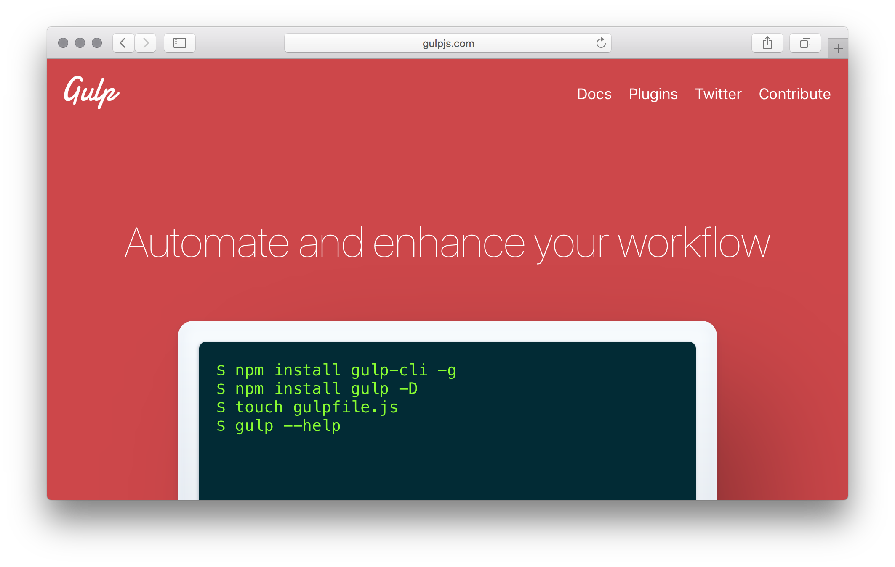

# gulpjs.com

This is the repository containing the code for the official gulp website [gulpjs.com](https://gulpjs.com).



## Contributing

To get started working on this site you first need to clone this repository
```
$ git clone https://github.com/gulpjs/gulpjs.github.io.git
```
then open the `index.html` in your favorite browser.   
You can also use a static file server like [st](https://www.npmjs.com/package/st) or [http-server](https://github.com/indexzero/http-server) to serve the website.

When you are done making your improvements, create a [Pull Request](https://github.com/gulpjs/gulpjs.github.io/compare).
